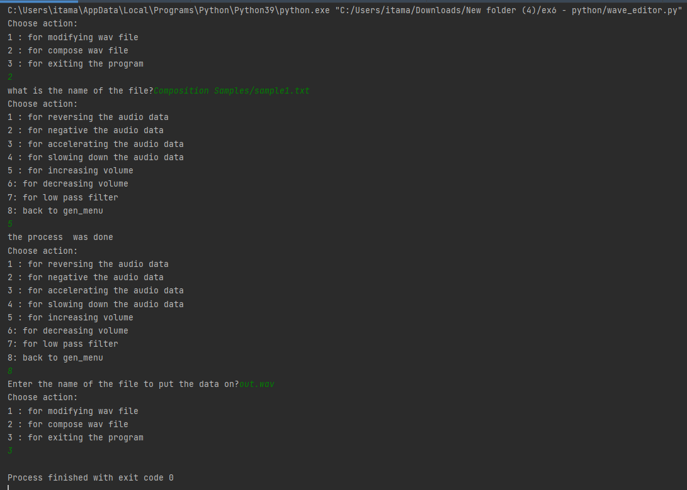
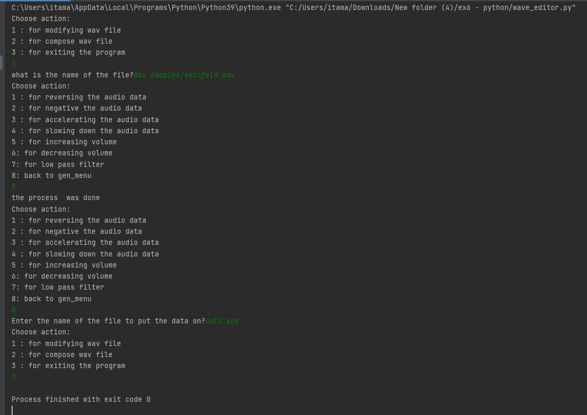

### Hadeling Wav file
Wav Samples and Composition Samples will be our input.

We can either compose or change already existing wav files.

Composing is made from getting a path to a .txt file.

Changing existing wav file is made from getting a path to a .wav file

The output will be in a file that the user choose his name. like: "out.wav".

### About the code
**wave_helper.py - is what we got from the Course faculty.**

So we didn't make it, and it's probably working right.

wave_editor.py - it's our main code. There may be some errors in it, but the overall is pretty good, I mean you can run it and it's works.

ex6.pdf - it's the instructions of the exercise.

out.wav - it's the output file. (you can choose everytime another output file)

Wav Samples, Composition Samples - samples to run on.

### Example of Composing wav file from .txt file:

The green is what I wrote.

  
 
### Example of changing existing wav file:

The green is what I wrote.

